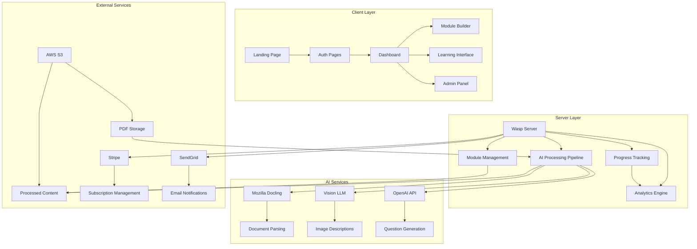
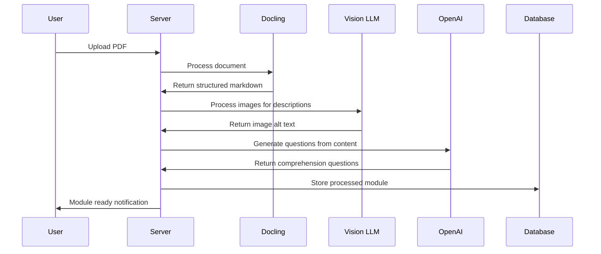

# Design Document

## Overview

The PDF-to-Learning SaaS platform transforms the existing OpenSaaS template into a specialized B2B learning management system powered by multiple AI services. The architecture leverages:

- **Mozilla AI's Docling**: Advanced document-to-markdown conversion with superior handling of complex layouts, tables, images, and formulas
- **Vision Language Models**: Automatic image description generation for accessibility and context
- **OpenAI API**: Auto-generation of comprehension questions and intelligent content segmentation
- **OpenSaaS Infrastructure**: Proven authentication, payments, file storage, and analytics

The system follows an AI-enhanced document-centric workflow: PDF upload → **AI processing pipeline** → intelligent module creation → team assignment → progress tracking → analytics reporting.

## Architecture

### High-Level System Architecture



### Data Flow Architecture

1. **AI-Powered PDF Processing Flow**: 
   - Client → S3 → Processing Queue → **Docling AI** (document parsing) → **VLM** (image descriptions) → **OpenAI** (question generation) → Structured Content → Database
2. **Learning Flow**: User Assignment → Module Access → Progress Tracking → Analytics Update
3. **Admin Flow**: Team Management → Module Assignment → Progress Monitoring → Reporting

## AI Integration Strategy

### Mozilla AI Docling Integration
- **Purpose**: Superior document-to-markdown conversion
- **Capabilities**: 
  - Complex PDF layouts with tables, images, and formulas
  - OCR for scanned documents (EasyOCR, Tesseract, RapidOCR, OcrMac)
  - Multi-language document support
  - Built-in VLM pipeline with SmolDocling for image descriptions
  - Code and formula enrichment features
  - Preserves document structure and formatting
- **Implementation**: Local Python library integration with DocumentConverter class and background job processing

### Vision Language Model Integration (Built into Docling)
- **Purpose**: Automatic image description generation
- **Capabilities**:
  - Generate descriptive alt text for accessibility using SmolDocling VLM
  - Extract context from charts, diagrams, and visual content
  - Support learning comprehension through visual descriptions
  - Document image classification with EfficientNet-B0
- **Implementation**: Built-in VLM pipeline in Docling with --pipeline vlm --vlm-model smoldocling options

### OpenAI API Integration (Existing)
- **Enhanced Purpose**: Beyond demo app to learning-focused features
- **New Capabilities**:
  - Auto-generate comprehension questions from content sections
  - Intelligent content segmentation suggestions
  - Learning objective extraction from documents
- **Implementation**: Extend existing OpenAI integration in OpenSaaS template

### AI Processing Workflow


## Components and Interfaces

### Core Components

#### 1. PDF Processing Pipeline (AI-Powered)
- **PDFProcessor**: Orchestrates document processing workflow
- **DoclingClient**: Interfaces with Mozilla AI's Docling service for intelligent document parsing
- **ContentSegmenter**: Uses AI to intelligently break processed content into logical learning sections
- **ImageDescriptor**: Leverages Vision Language Models (VLMs) to generate descriptive alt text for images
- **QuestionGenerator**: Uses OpenAI API to auto-generate comprehension questions from content sections

#### 2. Learning Module System
- **ModuleBuilder**: Creates and manages learning modules
- **ContentRenderer**: Displays processed content with navigation
- **ProgressTracker**: Monitors user progress through modules
- **BookmarkManager**: Handles save/resume functionality

#### 3. Team Management
- **TeamController**: Manages team members and permissions
- **AssignmentManager**: Handles module assignments
- **NotificationService**: Sends assignment and completion alerts

#### 4. Analytics & Reporting
- **LearningAnalytics**: Tracks completion rates and engagement
- **ReportGenerator**: Creates exportable progress reports
- **DashboardService**: Aggregates data for admin views

### API Interfaces

#### PDF Processing Operations
```typescript
// Upload and process PDF
action uploadPDF {
  fn: import { uploadPDF } from "@src/pdf-processing/operations"
  entities: [User, LearningModule, File]
}

// Get processing status
query getProcessingStatus {
  fn: import { getProcessingStatus } from "@src/pdf-processing/operations"
  entities: [LearningModule]
}
```

#### Module Management Operations
```typescript
// Create/update learning module
action createLearningModule {
  fn: import { createLearningModule } from "@src/modules/operations"
  entities: [User, LearningModule]
}

// Get user's modules
query getUserModules {
  fn: import { getUserModules } from "@src/modules/operations"
  entities: [User, LearningModule, ModuleAssignment]
}
```

#### Progress Tracking Operations
```typescript
// Update learning progress
action updateProgress {
  fn: import { updateProgress } from "@src/progress/operations"
  entities: [User, LearningModule, UserProgress]
}

// Get team progress
query getTeamProgress {
  fn: import { getTeamProgress } from "@src/progress/operations"
  entities: [User, UserProgress, ModuleAssignment]
}
```

## Data Models

### Extended User Entity
```prisma
model User {
  // Existing OpenSaaS fields
  id                        Int             @id @default(autoincrement())
  email                     String?         @unique
  username                  String?
  isAdmin                   Boolean         @default(false)
  subscriptionPlan          String?
  subscriptionStatus        String?
  
  // New PDF Learning fields
  organizationId            Int?
  role                      UserRole        @default(LEARNER)
  createdModules            LearningModule[] @relation("ModuleCreator")
  assignedModules           ModuleAssignment[]
  progress                  UserProgress[]
  organization              Organization?   @relation(fields: [organizationId], references: [id])
}

enum UserRole {
  ADMIN
  LEARNER
}
```

### New Entities
```prisma
model Organization {
  id                Int                 @id @default(autoincrement())
  name              String
  subscriptionTier  SubscriptionTier
  maxModules        Int?
  maxUsers          Int?
  users             User[]
  modules           LearningModule[]
  createdAt         DateTime            @default(now())
}

model LearningModule {
  id                Int                 @id @default(autoincrement())
  title             String
  description       String?
  originalFileName  String
  fileKey           String              // S3 key for original PDF
  processedContent  Json                // Structured content from Docling
  sections          ModuleSection[]
  assignments       ModuleAssignment[]
  creatorId         Int
  organizationId    Int
  processingStatus  ProcessingStatus    @default(PENDING)
  createdAt         DateTime            @default(now())
  updatedAt         DateTime            @updatedAt
  
  creator           User                @relation("ModuleCreator", fields: [creatorId], references: [id])
  organization      Organization        @relation(fields: [organizationId], references: [id])
}

model ModuleSection {
  id                Int                 @id @default(autoincrement())
  moduleId          Int
  title             String
  content           String              // Markdown content
  orderIndex        Int
  estimatedMinutes  Int?
  
  module            LearningModule      @relation(fields: [moduleId], references: [id], onDelete: Cascade)
  progress          UserProgress[]
}

model ModuleAssignment {
  id                Int                 @id @default(autoincrement())
  userId            Int
  moduleId          Int
  assignedAt        DateTime            @default(now())
  dueDate           DateTime?
  completedAt       DateTime?
  
  user              User                @relation(fields: [userId], references: [id])
  module            LearningModule      @relation(fields: [moduleId], references: [id])
  
  @@unique([userId, moduleId])
}

model UserProgress {
  id                Int                 @id @default(autoincrement())
  userId            Int
  moduleId          Int
  sectionId         Int
  completed         Boolean             @default(false)
  timeSpent         Int                 @default(0) // minutes
  lastAccessed      DateTime            @default(now())
  bookmarkPosition  String?             // JSON for scroll position, etc.
  
  user              User                @relation(fields: [userId], references: [id])
  module            LearningModule      @relation(fields: [moduleId], references: [id])
  section           ModuleSection       @relation(fields: [sectionId], references: [id])
  
  @@unique([userId, moduleId, sectionId])
}

enum ProcessingStatus {
  PENDING
  PROCESSING
  COMPLETED
  FAILED
}

enum SubscriptionTier {
  STARTER
  PROFESSIONAL
  ENTERPRISE
}
```

## Error Handling

### PDF Processing Errors
- **Upload Failures**: Validate file type, size limits, and S3 connectivity
- **Processing Failures**: Handle Docling API errors, timeout scenarios, and malformed PDFs
- **Content Extraction**: Graceful degradation for complex layouts, OCR failures

### User Experience Errors
- **Access Control**: Clear messaging for subscription limits and permissions
- **Progress Sync**: Handle offline scenarios and progress conflicts
- **Assignment Errors**: Validate team membership and module availability

### System Errors
- **Database Constraints**: Handle unique violations and referential integrity
- **External Service Failures**: Implement retry logic and fallback mechanisms
- **Rate Limiting**: Queue management for PDF processing and API calls

## Testing Strategy

### Unit Testing
- PDF processing pipeline components
- Content segmentation algorithms
- Progress tracking calculations
- Analytics aggregation functions

### Integration Testing
- Docling API integration
- S3 file operations
- Email notification delivery
- Stripe webhook processing

### End-to-End Testing
- Complete PDF-to-module workflow
- User assignment and progress tracking
- Team management scenarios
- Subscription tier enforcement

### Performance Testing
- Large PDF processing times
- Concurrent user learning sessions
- Analytics query performance
- File storage and retrieval speeds

## Security Considerations

### Data Protection
- PDF content encryption at rest in S3
- User progress data privacy
- Organization data isolation
- GDPR compliance for EU users

### Access Control
- Role-based permissions (Admin/Learner)
- Organization-level data segregation
- Module assignment validation
- API endpoint authorization

### File Security
- PDF upload validation and sanitization
- Malware scanning integration
- Content type verification
- Size and rate limiting

## Performance Optimization

### PDF Processing
- Asynchronous processing with job queues
- Caching of processed content
- Progressive content loading
- Batch processing for multiple uploads

### Learning Interface
- Lazy loading of module sections
- Client-side progress caching
- Optimized content rendering
- Mobile-responsive design

### Analytics
- Background job for metrics calculation
- Cached dashboard data
- Efficient database queries
- Real-time vs. batch updates

## Deployment Considerations

### Infrastructure Requirements
- Extended S3 storage for PDFs and processed content
- Increased server capacity for document processing
- Job queue infrastructure (PgBoss)
- CDN for content delivery

### Environment Configuration
- Docling API credentials and endpoints
- Enhanced S3 bucket policies
- Processing queue configuration
- Monitoring and alerting setup

### Migration Strategy
- Extend existing OpenSaaS database schema
- Preserve existing user accounts and subscriptions
- Gradual feature rollout
- Data backup and recovery procedures